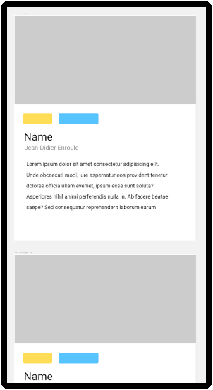
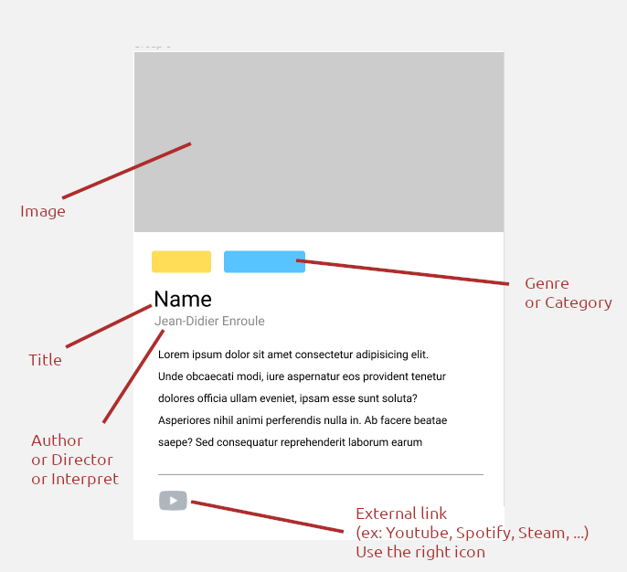

# The Collection

## The challenge

The goal of this project will be to summarize our current knowledge of :

- HTML and CSS
- Responsive design
- Javascript Basics
- The DOM

to create a collection of items. 
This project will be split up in two parts.

---

- Create a public repository: `[your-name]s-collection` 
- Solo or duo

### What are we going to craft?

Especially since the Covid outbreak, we're all using streaming services such as Spotify, Netflix, Disney+, or even Popcorn Time. We book our holidays on internet with AirBnb, we play games through elaborate clients such as Steam, we care about meaningful reviews on Rotten Tomatoes or IMDB, we can even shop NFTs on online platforms like we would in an art gallery, and many other things...

The common denominator of all those services they all feature a unified stream of content, a **collection** of some sort. In this challenge we are going to split up the work in two parts to try to replicate this.

## Part one

### Gathering some informations

Your first mission will be to gather a list of things you like, could be anything, some examples :

- Music
- Video games
- Movies or series
- Books
- Paintings
- Football players (like those old Panini collectables)
- Recipes


Once you chose **one** of the topics above (or anything else that suits you), it is time to think of items to put in your collection. You have to come up with **at least 10**  items.

For each of these item you'll have to find relevant information about it. For example if you make a movie collection, you could come up with :

- The movie title
- Its release date
- Its director
- Some cast members
- A (or multiple) genre(s)
- A short description of the movie
- A link to the trailer
- A picture

You'll need **at least 5 fields** for each item!


### Translate this to javascript

Once the above step is done, you'll have to find a way to store this list as a Javascript variable.

Create a `collection.js` file in your folder and try to find the best data structure that would fit your collection in a single constant.

Something like this would be a good starting point:
```javascript
const COLLECTION = [
  {
    name: 'Pulp Fiction',
    director: 'Quentin Tarantino',
    releaseYear: 1994,
    picture: 'link/to/a/picture',
    genre: ['Crime', 'Drama'],
    cast: ['John Travolta', 'Samuel L Jackson', 'Uma Thurman', 'Amanda Plummer']
  },

  // ...
]
```

### Translate this into HTML

Once this is done, you'll have to display your collection in a nice, **responsive** way.

Make your own design, using grid and/or flex techniques, and create the corresponding HTML skeleton and css file.

For each of your items you'll have to create a card element using the appropriate semantic tags. **The cards must be generated using Javascript** (the rest of the layout can be plain HTML).

The layout should somewhat look like this






If you need some inspiration, check out the websites cited in the introduction, or have a look at Behance or Dribble.

## Part TWO

Now that we are aware of events let's pimp our collection and add some interactivity. 

Add some filtering