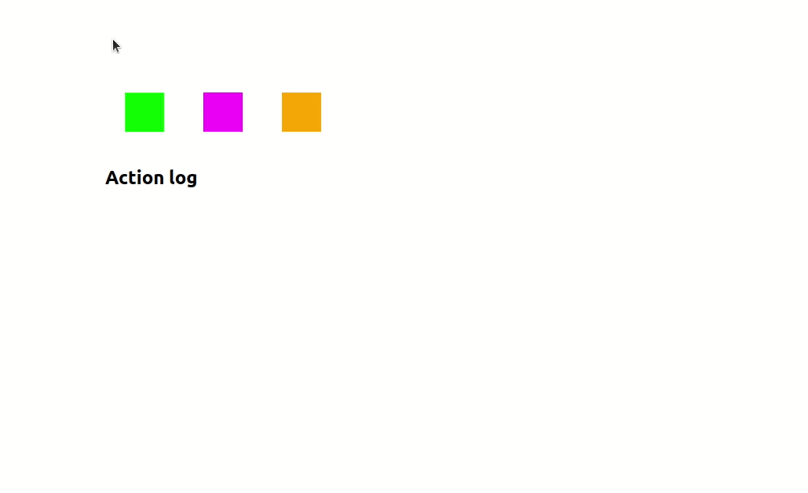

# Working with events

## What is an event?

Any action that is triggered by the user is called an event. 

## The 3 key elements of an event

### The trigger

An event is always triggered by an action, it could be anything ranging from :

- A mouseclick
- A movement of the mouse pointer
- A key has been pressed on the keyboard
- The screen was resized
- The window is being scrolled
- The page has finished loading
- A CSS animation is playing

[and many, many more...](https://developer.mozilla.org/en-US/docs/Web/Events)

### The target 

The target is the element that will receive the action. Could be the body of the page, could be the a button, could be a form field such as a text input, etc. Really anything that is displayed on the page, whether it is there at page load or generated using Javascript could be a target


### The callback

The callback is the consequence of the event, it's a function that will be executed once an action is triggered on a target.


### An example is worth a thousand words

Let say we want to display an "alert" whenever a button is clicked. We will have a :
- trigger: **a mouseclick**
- target: **a button**
- callback: **displaying an alert**

Suppose we have the following HTML code:

```html
<button>Click me!</button>
```

We can achieve this with the following javascript code:
```javascript
// We select the button
const button = document.querySelector('button')

// Create a callback function that will called whenever 
function displayAnAlert(){
  return alert('The button shall not be pressed!')
}

// We create an event listener
button.addEventListener(
  'click', // we listen to the click event
  displayAnAlert // We trigger the callback function
)
```

There is a thousand more things we can explore with events but let's explore the new possibilities we have now.


## Exercises

Open the [script.js](./script.js) file and edit it, so that:
- Everytime the user clicks on one of the action squares
  - Create a new `<div>` with a class `.displayedsquare` and the corresponding clicked color in the div above (`.displayedsquare-wrapper`)
  - Create a new `<li>` in the log below to state when the action was done

- Add an event listener on the document `<body>`, listening for the `keypress` event. (hint: [have a look at this](https://keycode.info/))
  - When the `spacebar` is hit randomly change the background color of the whole page
  - Log when the `spacebar` is used the same way you used for the generated squares.
  - When the <key>l</key> key is pressed the log gets deleted (erases the generated `<li>`s)
  - When the <key>s</key> key is pressed the squares get deleted (erases the generated squares)
- Create a system so that when a user clicks on a generated square an alert pops-up with the color of that square
