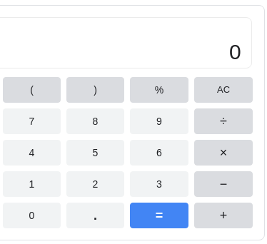

# Let's build a calculator

Using what we know about javascript, we're going to build a simple calculator app.

- Type of challenge: `consolidation`  
- Duration: `2 days`  
- Team challenge: `solo`

## Learning objectives

At the end of this challenge you should be able to generate a simple app using the DOM utils and events.

## The mission

- Create a new repository named `calculator`
- Create a `calculator.js` file.
- Create a file named `index.html`. In the `<body>` you can only put an empty `<main>` tag, and the link to your javascript file. 
- You have to generate a calculator layout with a display on top and all the digits buttons (0 to 9), the operation buttons (`+`, `-`, `x`, `/`), a button to calculate the result (`=`) and a button to clear the display (`C`)
- Clicking on the buttons should emulate the behavior of a calculator.


### BONUS

- Make it pretty
- Create an history of the previous operations
- Scientific calculator (trigonometry, logarithms, ...). The [Math library](https://developer.mozilla.org/en-US/docs/Web/JavaScript/Reference/Global_Objects/Math) is pretty convenient for this.
- Unit conversion (could be money or imperial units to metric system for example)
- Pressing enter to display the result (same as pressing the `=` button)
- Pressing number keys on the keyboard should have the same effect as pressing the calculator buttons
- Is it responsive? It'd better be!

## Resources

### Inspiration

Take a look at the [google calculator](https://www.google.com/search?q=calculator) for inspiration.



You can also look at your smartphone calculator app, or any app that is available online.

### The "result" button

Pressing on the `=` button should compute the whole line. Javascript has a function for this named `eval`, `EVAL IS EVIL` you should [never use that function](https://www.digitalocean.com/community/tutorials/js-eval).

Instead, I made a short function, it will do the trick, feel free to use it in your code:
```javascript
function computeResult(str){
  return Function('return ' + str)()
}

const a = '(13 + 17) / 3'

console.log(computeResult(a)) // Should display 10
```
